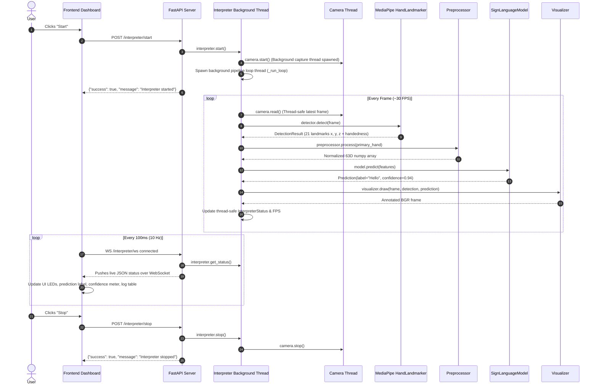

# Sign Language Interpreter — Complete Tech Stack, Architecture & Viva Defense Guide

> **Target Audience:** Development team and viva/presentation examiners.  
> **Repository:** `daksh25BAI10927/Sign-Language-Interpretation`  
> **Core Concept:** Real-time sign language recognition using Computer Vision (MediaPipe + OpenCV), normalized coordinate feature extraction, modular ML inference, FastAPI backend with WebSockets, and a modern responsive dashboard frontend.

---

## 1. Executive Summary & Core Objective

The project translates American Sign Language (ASL) / hand gestures captured by a standard webcam into text in real time. 

Instead of passing heavy raw camera images directly to complex deep-learning networks, this architecture uses a **two-stage pipeline**:
1. **Pose/Landmark Extraction:** Extracts 21 3D anatomical hand landmarks using Google's MediaPipe Tasks API.
2. **Feature Normalization & Classification:** Centers landmarks on the wrist, normalizes for hand size/distance, and predicts the sign via a decoupled ML model interface.
3. **Real-time Delivery:** Exposes REST endpoints and high-speed WebSockets via FastAPI to stream live predictions, confidence scores, and system telemetry to a web dashboard.

```
 Webcam Frame (OpenCV)
         │
         ▼
 MediaPipe HandLandmarker (21 3D Landmarks)
         │
         ▼
 Coordinate Preprocessing (Wrist-centering + Scale-normalization -> 63D Vector)
         │
         ▼
 Machine Learning Inference (SignLanguageModel Interface)
         │
         ▼
 Live WebSocket Push (~10 Hz) + Visualizer Overlay
         │
         ▼
 Frontend Dashboard (Real-time Prediction, Confidence Bar, Logs)
```

---

## 2. Complete Technology Stack

| Layer / Domain | Technology / Library | Version | Purpose in this Project |
|---|---|---|---|
| **Programming Language** | **Python** | `>= 3.10` | Core backend runtime, pipeline orchestration, ML scripts |
| **Computer Vision (Capture & Render)** | **OpenCV (`opencv-python`)** | `>= 4.9.0` | Webcam video capture (`cv2.VideoCapture`), BGR/RGB conversion, skeleton line/circle rendering, local dev window |
| **Hand Landmark Detection** | **Google MediaPipe** | `>= 0.10.14` | MediaPipe Tasks `HandLandmarker` (`hand_landmarker.task` bundle). Detects 21 3D coordinates $(x, y, z)$ per hand and handedness |
| **Numerical Processing** | **NumPy** | `>= 1.26.0` | Coordinate transformations, Euclidean norm calculations, feature vector flattening and manipulation |
| **Backend Framework** | **FastAPI** | `>= 0.111.0` | Asynchronous REST API routing, WebSocket endpoints, application lifecycle management, CORS middleware |
| **ASGI Web Server** | **Uvicorn** | `>= 0.29.0` | Production ASGI web server running FastAPI with uvloop support |
| **Data Validation & Settings** | **Pydantic & Pydantic-Settings** | `>= 2.7.0` | Environment configuration loading (`.env`), request/response JSON validation schemas |
| **Configuration** | **python-dotenv** | `>= 1.0.1` | Automated parsing of local `.env` environment configuration files |
| **Real-time Communication** | **WebSockets (`websockets`)** | `>= 12.0` | Low-latency duplex connection pushing telemetry JSON to client at ~10 Hz |
| **Standalone ML / Training** | **TensorFlow / Keras** | `2.x` | Used in `mlcode.py` for CNN-based image classification and data collection scripts |
| **Frontend Framework** | **Vanilla HTML5, Modern CSS3, ES6+ JavaScript** | Modern Browsers | Zero-dependency, zero-build client dashboard ("SIGNAL") with WebSockets and DOM rendering |
| **Testing & CI** | **pytest, pytest-asyncio, HTTPX** | `>= 8.2.0` | Unit and integration testing with mocked camera and detection hardware |

---

## 3. Directory Structure & Module Responsibilities

The codebase strictly follows the **Single Responsibility Principle (SRP)** and **Dependency Inversion Principle (DIP)**:

```
Sign-Language-Interpretation/
├── backend/
│   ├── api/
│   │   ├── routes.py            # REST endpoints: POST /interpreter/start, /stop, GET /status
│   │   └── websocket.py         # WebSocket endpoint: WS /interpreter/ws (10 updates/sec)
│   ├── camera/
│   │   └── camera.py            # Threaded VideoCapture wrapper (only camera I/O, no CV/ML)
│   ├── config/
│   │   └── settings.py          # Centralized Pydantic settings loaded from .env
│   ├── hand_detection/
│   │   ├── detector.py          # MediaPipe Tasks HandLandmarker wrapper & auto-downloader
│   │   └── landmarks.py         # Pure dataclasses: Landmark, DetectedHand, DetectionResult
│   ├── model/
│   │   ├── base_model.py        # Abstract Base Class (SignLanguageModel) & Prediction dataclass
│   │   └── mock_model.py        # Deterministic mock predictor for testing & development
│   ├── pipeline/
│   │   └── interpreter.py       # Threaded orchestrator: Camera -> Detector -> Preprocessor -> Model
│   ├── preprocessing/
│   │   └── preprocessor.py      # Translates 21 landmarks into wrist-centered 63D feature vector
│   ├── utils/
│   │   └── logging_config.py    # Logging setup and formatters
│   ├── visualization/
│   │   └── visualizer.py        # Draws 21-joint skeleton lines & text overlays on OpenCV frames
│   ├── camera.py                # Standalone landmark dataset collection script (saves to CSV)
│   ├── test_camera.py           # Quick webcam verification script
│   └── main.py                  # Wire-up root: builds dependency graph, runs FastAPI or manual preview
├── frontend/
│   ├── index.html               # Semantic dashboard layout, status LEDs, telemetry displays
│   ├── style.css                # Dark tech-aesthetic styling, responsive grid, animated gauges
│   └── app.js                   # Client-side state manager, WebSocket client, auto-reconnect, CSV export
├── tests/                       # Unit and API test suite (mocked hardware)
├── main.py                      # Root convenience entry point (python main.py)
├── mlcode.py                    # Standalone CNN image training and detection pipeline
├── requirements.txt             # Pip dependency definitions
└── pyproject.toml               # Project metadata and configuration
```

---

## 4. In-Depth Workflow & Pipeline Execution



---

## 5. Key Technical Implementations (The "How It Works")

### A. Preprocessing Mathematics (Crucial for Viva)
In `backend/preprocessing/preprocessor.py`:
1. **Raw Landmarks:** MediaPipe extracts 21 points with coordinates in $[0, 1]$ relative to image dimensions:
   $$\mathbf{P}_i = (x_i, y_i, z_i), \quad i \in [0, 20]$$
2. **Translation Invariance (Wrist Centering):**
   The wrist is landmark index `0`. We subtract the wrist coordinate from all 21 points:
   $$\mathbf{P}'_i = \mathbf{P}_i - \mathbf{P}_0$$
   *Why?* The coordinates become relative to the hand itself. Whether your hand is in the top-left, center, or bottom-right of the webcam frame, the feature values are identical.
3. **Scale Invariance (Distance Normalization):**
   We calculate the Euclidean distance between the wrist ($0$) and the middle finger MCP knuckle ($9$):
   $$s = \|\mathbf{P}'_9\|_2 = \sqrt{(x'_9)^2 + (y'_9)^2 + (z'_9)^2}$$
   We divide all centered coordinates by this scale factor:
   $$\mathbf{P}''_i = \frac{\mathbf{P}'_i}{s}$$
   *Why?* Moving your hand closer to or further from the webcam changes hand size in pixels, but the normalized proportions remain constant!
4. **Vector Flattening:**
   The $21 \times 3$ matrix is flattened into a 1D vector of shape **$(63,)$**:
   $$[x''_0, y''_0, z''_0, x''_1, y''_1, z''_1, \dots, x''_{20}, y''_{20}, z''_{20}]$$

### B. Concurrency & Threading Architecture
- **Problem:** `cv2.VideoCapture.read()` is a blocking I/O operation. If called on the main thread, the entire web server would stutter and freeze.
- **Solution:** 
  - `Camera` maintains its own dedicated capture daemon thread (`camera-capture-loop`) constantly pulling frames into a thread-safe buffer guarded by `threading.Lock`.
  - `Interpreter` maintains its own pipeline daemon thread (`interpreter-loop`) processing frames at a controlled pacing (`pipeline_target_fps = 30`).
  - The FastAPI async event loop is completely unblocked to serve REST and WebSocket traffic concurrently.

### C. MediaPipe Tasks API vs Legacy Solutions
- Older MediaPipe tutorials use `mp.solutions.hands`. In newer MediaPipe releases ($\ge 0.10.x$), this API is deprecated and removed.
- This project implements the modern **MediaPipe Tasks Vision API** (`HandLandmarker`) utilizing the standalone model bundle `hand_landmarker.task`.
- The detector module contains automated fallback logic: if `hand_landmarker.task` is missing locally, it automatically downloads it from Google's official cloud storage.

### D. Pluggable Model Architecture
In `backend/model/base_model.py`:
```python
class SignLanguageModel(ABC):
    @abstractmethod
    def predict(self, features: Optional[np.ndarray]) -> Prediction:
        raise NotImplementedError
```
- **Why this is genius:** The system is completely decoupled. The camera, detector, API, and frontend don't know or care whether the model is a mock, a Scikit-Learn Random Forest, an XGBoost classifier, a PyTorch MLP, or a TensorFlow LSTM.
- To switch to a real trained model: simply create `RealSignLanguageModel(SignLanguageModel)` and change one line in `backend/main.py:build_interpreter()`.

---

## 6. Examiner Viva Q&A Cheat Sheet (What Teammates Must Know)

### Q1: "Why did you use MediaPipe landmarks instead of just feeding the webcam image directly to a CNN?"
> **Answer:**  
> "A raw image CNN has to process $224 \times 224 \times 3 \approx 150,000$ pixel values. It is easily confused by different skin tones, complex background clutter, and varying room lighting.  
> By using MediaPipe, we reduce 150,000 pixels down to just **21 key landmarks (63 geometric coordinates)**. MediaPipe already handles background segmentation and hand detection at the edge. A landmark-based model is lightweight (runs at 30+ FPS on any normal CPU without a GPU), privacy-friendly, and invariant to skin color or background changes."

### Q2: "What preprocessing steps are applied to the landmarks, and why?"
> **Answer:**  
> "We apply two critical geometric transformations:
> 1. **Translation Normalization (Wrist Centering):** We subtract the $(x,y,z)$ coordinates of landmark 0 (the wrist) from all 21 points. This ensures hand position inside the camera frame does not change the prediction.
> 2. **Scale Normalization:** We divide all coordinates by the Euclidean distance between the wrist and landmark 9 (middle finger knuckle). This ensures hand distance from the camera (depth) does not distort the model's features.  
> The result is a clean, scale- and translation-invariant 63-dimensional feature vector."

### Q3: "Why use WebSockets instead of normal HTTP GET polling for the live feed?"
> **Answer:**  
> "HTTP polling requires opening a new TCP connection and sending full HTTP headers back and forth 10 to 30 times a second, which introduces latency and heavy server overhead.  
> A WebSocket creates a persistent, full-duplex TCP connection established once during handshake. The server simply pushes lightweight JSON telemetry frames every 100 milliseconds directly to the frontend with almost zero protocol overhead."

### Q4: "How does the system handle concurrency? Does the camera block the web server?"
> **Answer:**  
> "No, we use a multithreaded architecture with thread locks (`threading.Lock`).  
> 1. The `Camera` class runs a dedicated background daemon thread for `cv2.VideoCapture` frame grabbing so I/O never blocks.  
> 2. The `Interpreter` pipeline runs on its own background thread, processing frames at 30 FPS.  
> 3. FastAPI and Uvicorn run on an async event loop, reading the latest results from memory via thread-safe methods (`get_status()`), guaranteeing instant API and WebSocket responses."

### Q5: "What is the difference between `mlcode.py` and the main backend?"
> **Answer:**  
> "`mlcode.py` is an alternative experimental script that uses a Convolutional Neural Network (CNN) directly on cropped hand image patches ($224 \times 224$).  
> The main production backend uses the coordinate-landmark architecture (`detector.py` + `preprocessor.py`), which is vastly faster, cleaner, and decoupled. We also have `backend/camera.py` which can log landmark vectors directly to CSV (`data/landmarks.csv`) to train coordinate classifiers."

### Q6: "What happens when no hand is in front of the camera? Does it crash?"
> **Answer:**  
> "No. When no hand is detected, MediaPipe returns an empty landmark list. The `HandDetector` returns a `DetectionResult(hand_detected=False)`. The `Preprocessor` returns `None`, and the model contract returns `Prediction(label='No sign detected', confidence=0.0)`. 'No hand' is treated as a standard state, not an exception."

### Q7: "How would you extend this project in the future?"
> **Answer:**  
> "1. **Dynamic/Temporal Gestures:** Add an LSTM, GRU, or 1D-CNN temporal window buffer to recognize motion-based words (e.g. J, Z, or phrases) over a sequence of frames.  
> 2. **Two-Hand Support:** MediaPipe and `Preprocessor.process_many()` already support multiple hands; we just need a two-hand trained classifier.  
> 3. **NLP Sentence Formation & Text-to-Speech:** Feed consecutive signs into an LLM/NLP smoothing model to formulate grammatically correct sentences and speak them aloud using the Web Speech API."

---

## 7. How to Run the Project (Quick Commands)

### 1. Setup Environment
```bash
# Create virtual environment
python -m venv venv
venv\Scripts\activate       # Windows
# source venv/bin/activate  # Linux/Mac

# Install dependencies
pip install -r requirements.txt
```

### 2. Run in Manual Development Mode (OpenCV Window)
```bash
python main.py
# Press 'q' to exit
```

### 3. Run in Full Stack Mode (FastAPI + Web Dashboard)
```bash
# Terminal 1: Start FastAPI Backend
uvicorn backend.main:app --reload --host 127.0.0.1 --port 8000

# Terminal 2: Open Frontend
# Simply double-click frontend/index.html or serve it via:
python -m http.server 3000 --directory frontend
```
Navigate to `http://127.0.0.1:3000` (or open `frontend/index.html` in your browser). Click **Start** to initiate live recognition.

### 4. Run Automated Test Suite
```bash
pytest
```
*(Tests run automatically with mocked camera and hardware, so no webcam is required to pass tests).*
